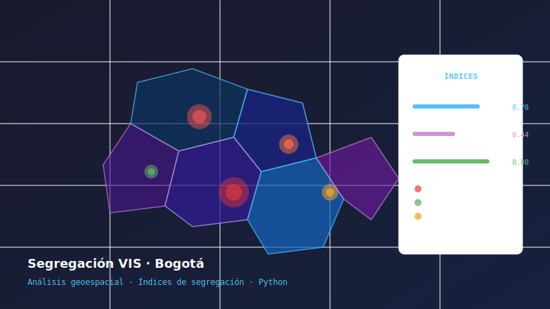
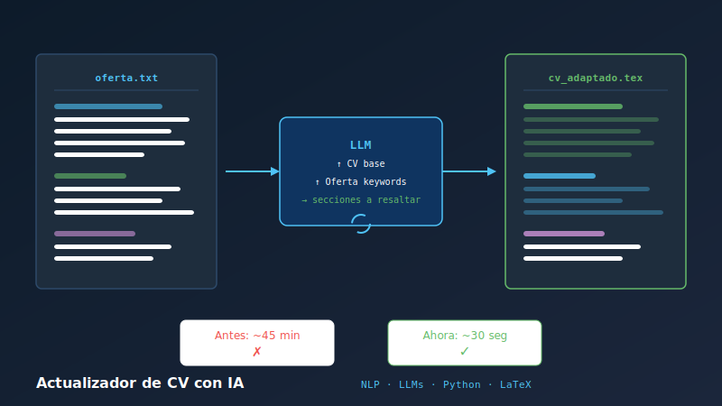

```{=html}
<header class="masthead">
  <div class="masthead-top">
    <span class="edition">Vol. I · No. 1</span>
    <span class="date">Saturday, April 11, 2026</span>
    <span class="locale">Bogotá · 18°C</span>
  </div>
  <h1 class="masthead-title">The Yeison Times</h1>
  <div class="masthead-tagline">"All the Data That's Fit to Model"</div>
  <div class="masthead-rule"></div>
</header>
```

::: {.author-header}

::: {.author-photo}

:::

::: {.author-info}
[Data Science Portfolio]{.kicker}

# Yeison Armando Buitrago López

[By **YEISON BUITRAGO** · Data Scientist at Habi Colombia · Statistics Specialization, UNAL]{.byline}

::: {.contact-links}
[✉ Email](mailto:buitragolopezyeison@gmail.com)
[⌥ GitHub](https://github.com/YeisonBL)
[in LinkedIn](https://linkedin.com/in/yeisonabl)
:::
:::

:::

::: {.lede}
I am a Data Scientist based in Bogotá, Colombia, working at the intersection of statistics, machine learning, and real business problems. Currently at **Habi**, where I design price elasticity models and A/B experiments for the Colombian real estate market. I hold a degree in **Mathematics from Universidad Distrital FJC** and am completing a **Statistics Specialization at Universidad Nacional de Colombia**.
:::

## Professional Experience

**Habi Colombia** — *Mid Data Scientist* `Aug 2025 – Present`

Design and deployment of price elasticity models across the offer portfolio. Bayesian experimentation with custom experimental design to increase contribution margin. Redesign of reference price data sources to improve client value proposition.

**Habi Colombia** — *Junior Data Scientist* `Mar 2024 – Aug 2025`

Automation and production deployment of geospatial pipelines in Python and BigQuery (GCP). Predictive models on real estate data for bank credit origination. Introduction of A/B testing as an organizational practice; stakeholder communication via dashboards.

**Frubana Colombia** — *Demand Planning Specialist* `Nov 2022 – Feb 2024`

Demand forecasting models over thousands of SKUs at a mass-consumption company (Python + SQL). Internal tool for supply chain analysts to detect atypical demand patterns.

---

## Research Projects

```{=html}
<div class="project-grid">

  <div class="project-card">
    <a href="projects/vis-segregacion-bogota.qmd"></a>
    <div class="project-card-body">
      <div class="project-tags">
        <span class="tag">Geospatial</span>
        <span class="tag">Statistics</span>
        <span class="tag">Python</span>
        <span class="tag">Public Policy</span>
      </div>
      <h3>VIS Housing Segregation in Bogotá</h3>
      <p>Research on how Social Interest Housing contributes to urban segregation in Bogotá. Dissimilarity indices, Moran's I spatial autocorrelation, and interactive maps with Kepler.gl.</p>
      <a href="projects/vis-segregacion-bogota.qmd" class="project-link">View project →</a>
    </div>
  </div>

  <div class="project-card">
    <a href="projects/cv-actualizador-ia.qmd"></a>
    <div class="project-card-body">
      <div class="project-tags">
        <span class="tag">NLP</span>
        <span class="tag">LLMs</span>
        <span class="tag">Automation</span>
        <span class="tag">Python</span>
        <span class="tag">LaTeX</span>
      </div>
      <h3>AI-Powered CV Updater</h3>
      <p>A tool that takes a job posting and automatically updates a LaTeX CV using a language model — reducing to seconds what otherwise takes hours.</p>
      <a href="projects/cv-actualizador-ia.qmd" class="project-link">View project →</a>
    </div>
  </div>

</div>
```

---

## Education

**Universidad Nacional de Colombia** — Statistics Specialization &emsp; `2025 – 2026`

**Universidad Distrital Francisco José de Caldas** — B.Sc. Mathematics &emsp; `2017 – 2022`
Honor roll (4 consecutive semesters, Top 10%)

---

## Technical Skills

```{=html}
<div class="skills-grid">
  <div class="skill-group">
    <span class="skill-label">Languages</span>
    <span class="skill-pill">Python</span>
    <span class="skill-pill">SQL</span>
    <span class="skill-pill">BigQuery</span>
  </div>
  <div class="skill-group">
    <span class="skill-label">ML & Stats</span>
    <span class="skill-pill">Predictive models</span>
    <span class="skill-pill">Bayesian A/B testing</span>
    <span class="skill-pill">Price elasticity</span>
    <span class="skill-pill">Inferential statistics</span>
  </div>
  <div class="skill-group">
    <span class="skill-label">Libraries</span>
    <span class="skill-pill">pandas</span>
    <span class="skill-pill">scikit-learn</span>
    <span class="skill-pill">geopandas</span>
    <span class="skill-pill">seaborn</span>
    <span class="skill-pill">Optuna</span>
  </div>
  <div class="skill-group">
    <span class="skill-label">ETL & Cloud</span>
    <span class="skill-pill">GCP</span>
    <span class="skill-pill">BigQuery</span>
    <span class="skill-pill">Python pipelines</span>
  </div>
  <div class="skill-group">
    <span class="skill-label">Visualization</span>
    <span class="skill-pill">Kepler.gl</span>
    <span class="skill-pill">Streamlit</span>
    <span class="skill-pill">Redash</span>
  </div>
  <div class="skill-group">
    <span class="skill-label">Tools</span>
    <span class="skill-pill">Git</span>
    <span class="skill-pill">GitHub</span>
    <span class="skill-pill">LaTeX</span>
  </div>
</div>
```

---

## Certifications

- **Deep Learning Specialization** — Coursera (Andrew Ng): neural networks, optimization, time series, TensorFlow
- Introduction to Data Science — Coursera
- Science Communication — Sociedad Matemática Mexicana (2021)

---

```{=html}
<div class="contact-strip">
  <div class="contact-strip-name">
    Yeison Buitrago
    <span>· Data Scientist · Bogotá, Colombia</span>
  </div>
  <div class="contact-strip-links">
    <a href="mailto:buitragolopezyeison@gmail.com">✉ buitragolopezyeison@gmail.com</a>
    <a href="https://github.com/YeisonBL">GitHub</a>
    <a href="https://linkedin.com/in/yeisonabl">LinkedIn</a>
  </div>
</div>
```
